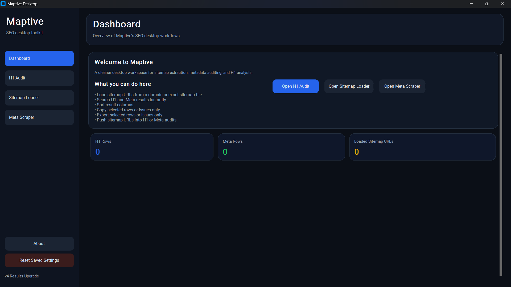
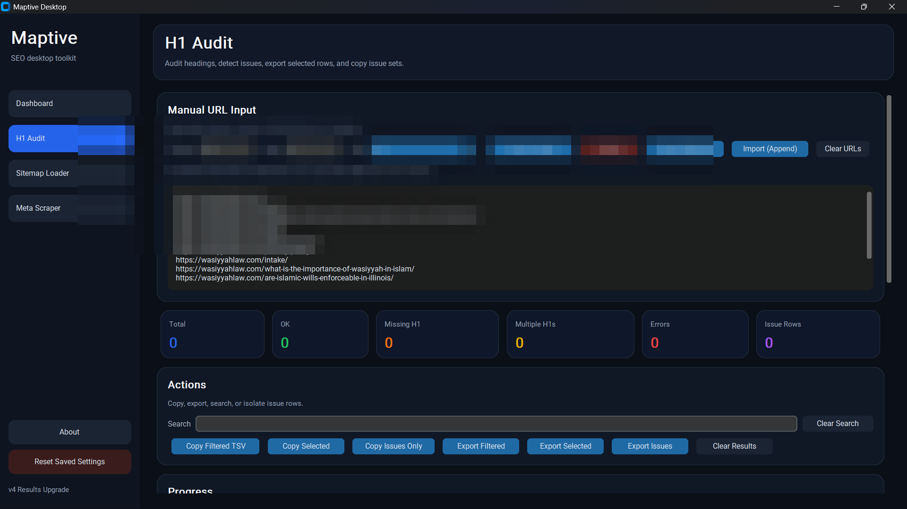
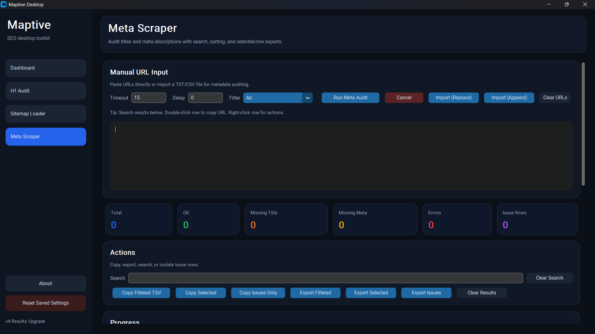
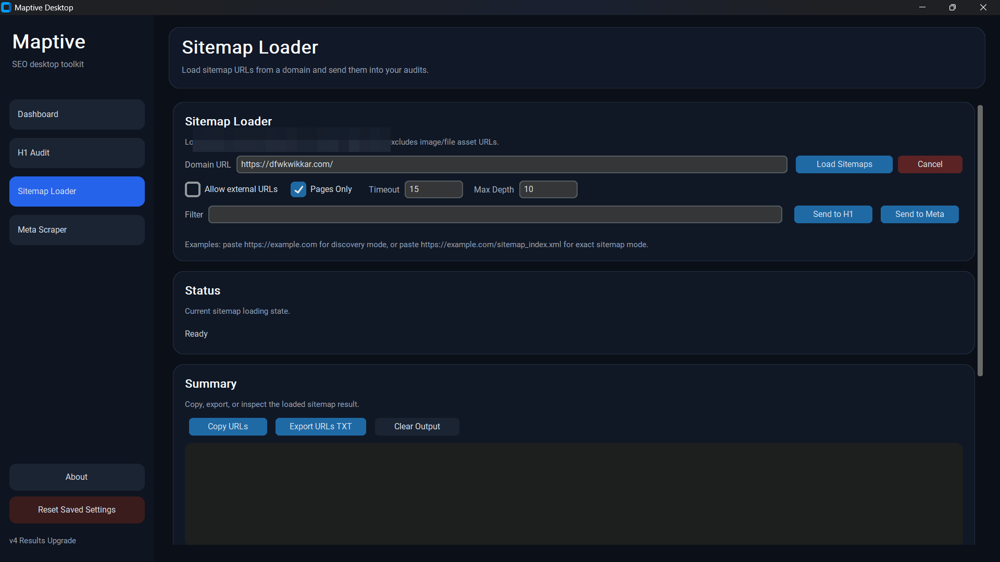
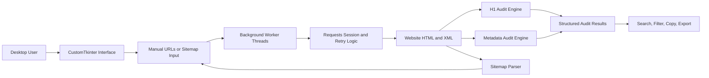

<p align="center">
  
</p>

<h1 align="center">Maptive SEO Audit Desktop</h1>

<p align="center">
  A local desktop utility for technical SEO auditing, sitemap discovery, H1 analysis, metadata validation, filtering, and export workflows.
</p>

<p align="center">
  
  
  
  
  
</p>

## Overview

Maptive is a Python desktop application designed to make repetitive technical SEO reviews faster and more consistent.

It accepts manually entered URLs or URLs discovered from XML sitemaps, processes them in the background, classifies common H1 and metadata issues, provides recommended actions, and supports filtering, copying, and exporting audit results.

The application runs locally and does not require a hosted backend.

| Workflow | What Maptive supports |
|---|---|
| **H1 audit** | Detect missing H1s, multiple H1s, valid single H1s, and promotable fallback headings |
| **Metadata audit** | Review title and meta-description presence, length, status, recommendations, priority, and required action |
| **Sitemap discovery** | Read robots.txt, discover common sitemap paths, parse sitemap indexes, support compressed sitemaps, and filter page URLs |
| **Productivity** | Background processing, search, filtering, sorting, copying, and export-ready result handling |
| **Privacy** | Local settings and processing without a server-side account or database |

## Application Preview

<table>
  <tr>
    <td width="50%" valign="top">
      <strong>Dashboard</strong><br><br>
      
      <br><sub>Central navigation and live audit totals for H1, metadata, and sitemap workflows.</sub>
    </td>
    <td width="50%" valign="top">
      <strong>H1 Audit</strong><br><br>
      
      <br><sub>Bulk H1 inspection with issue classification, recommendations, filters, and export actions.</sub>
    </td>
  </tr>
  <tr>
    <td width="50%" valign="top">
      <strong>Metadata Audit</strong><br><br>
      
      <br><sub>Title and meta-description validation with recommendations and priority labels.</sub>
    </td>
    <td width="50%" valign="top">
      <strong>Sitemap Loader</strong><br><br>
      
      <br><sub>Sitemap discovery, recursive parsing, page-only filtering, and URL transfer to audit modules.</sub>
    </td>
  </tr>
</table>

## Core Capabilities

### H1 auditing

- Detects missing, single, and multiple H1 headings
- Extracts heading text from HTML documents
- Identifies suitable fallback headings when no H1 exists
- Suggests recommended H1 text
- Produces change templates and action guidance
- Assigns issue priority based on audit status

### Metadata auditing

- Extracts page titles and meta descriptions
- Validates title and description length
- Flags missing, short, and long metadata
- Generates recommended title and description values
- Assigns priority and recommended action
- Handles redirects, timeouts, non-HTML pages, and fetch failures

### Sitemap processing

- Reads sitemap declarations from `robots.txt`
- Tries common sitemap locations when needed
- Parses sitemap indexes and URL sets
- Supports `.xml` and `.xml.gz`
- Recursively follows nested sitemaps
- Filters external links and non-page assets
- Sends loaded URLs directly to H1 or metadata audits

### Desktop workflow

- Responsive CustomTkinter interface
- Background worker threads to prevent UI freezing
- Search, filtering, sorting, and selected-row actions
- Copy and export workflows
- Local saved settings
- No hosted backend dependency

## System Architecture



## Technology Stack

| Area | Technologies |
|---|---|
| **Language** | Python |
| **Desktop interface** | CustomTkinter, Tkinter |
| **HTTP layer** | Requests, urllib3 retry adapters |
| **HTML parsing** | BeautifulSoup |
| **XML and sitemap parsing** | lxml, ElementTree, gzip |
| **Concurrency** | Python threading |
| **Distribution** | Local desktop execution |
| **License** | MIT |

## Installation

### Requirements

- Python 3.10 or newer recommended
- Internet connection for auditing public URLs
- Windows, macOS, or Linux with Tk support

### Setup

```bash
git clone https://github.com/Zackirito14/maptive-seo-audit-desktop.git
cd maptive-seo-audit-desktop

python -m venv .venv
```

Activate the virtual environment:

```bash
# Windows
.venv\Scripts\activate

# macOS or Linux
source .venv/bin/activate
```

Install dependencies and run the application:

```bash
pip install -r requirements.txt
python main.py
```

## Project Structure

```text
.
├── assets/
│   └── maptive-banner.svg
├── screenshots/
│   ├── dashboard.png
│   ├── h1-audit.png
│   ├── meta-audit.png
│   ├── sitemap-loader.png
│   └── README.md
├── h1_audit.py
├── main.py
├── maptive.ico
├── meta_audit.py
├── sitemap_parser.py
├── requirements.txt
├── .gitignore
├── LICENSE
└── README.md
```

## Module Responsibilities

| Module | Responsibility |
|---|---|
| `main.py` | Desktop application shell, navigation, controls, tables, background processing, filtering, copying, and exporting |
| `h1_audit.py` | URL fetching, H1 extraction, issue classification, recommendations, and change templates |
| `meta_audit.py` | Metadata extraction, length validation, recommendations, priorities, and fetch-status handling |
| `sitemap_parser.py` | Sitemap discovery, recursive parsing, compressed sitemap support, URL filtering, and asset exclusion |

## Reliability and Error Handling

- Normalizes URLs before processing
- Uses retry-enabled HTTP sessions
- Handles timeouts, redirects, invalid URLs, and non-HTML responses
- Keeps long-running audits off the UI thread
- Supports cancellation during processing
- Separates local settings and audit outputs from tracked source code

## Privacy

Maptive is intended for authorized technical SEO work.

The repository excludes local settings, client URL lists, audit exports, cached data, and private reports. The included screenshots have also been sanitized to remove audited website information.

Do not scan websites without authorization, and do not publish client URLs or audit results without permission.

## License

This project is released under the [MIT License](LICENSE).

## Contact

- **Portfolio:** [jorgen-fosgate.jorgengilfosgate.workers.dev](https://jorgen-fosgate.jorgengilfosgate.workers.dev)
- **GitHub:** [github.com/Zackirito14](https://github.com/Zackirito14)
- **LinkedIn:** [Jorgen Gil F. Fosgate](https://www.linkedin.com/in/jorgen-gil-fosgate-000a391b4/)

<p align="center">
  Built and documented by <strong>Jorgen Gil F. Fosgate</strong>
</p>
